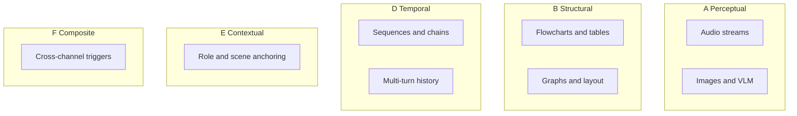

# Carrier Modality Projects

I grouped these by ontology class (A–F), not by surface modality. Each project file maps attack literature to how intent gets encoded in representations. See [ontology.md](../ontology.md) for definitions and [literature-index.md](../literature-index.md) for the paper crosswalk.

## A. Perceptual Carriers

| Modality | What carries intent | Status | Project |
|----------|---------------------|--------|---------|
| Images and VLM attacks | Pixels, patches, encoder features | literature-mapped | [perceptual-images-vlm.md](perceptual-images-vlm.md) |
| Audio streams | Waveforms, spectrograms, prepend segments | literature-mapped | [audio-streams.md](audio-streams.md) |

## B. Structural Carriers

| Modality | What carries intent | Status | Project |
|----------|---------------------|--------|---------|
| Graphs and relational layout | Node-edge structure, document regions | literature-mapped | [relational-structure.md](relational-structure.md) |
| Flowcharts, tables, records | Row/column/field relationships | literature-mapped | [structural-tables-flowcharts.md](structural-tables-flowcharts.md) |

## C. Symbolic Carriers

| Modality | What carries intent | Status | Project |
|----------|---------------------|--------|---------|
| Formal notation and math | Symbolic semantics, not surface words | draft | — (see [ontology.md](../ontology.md) §C) |

## D. Temporal Carriers

| Modality | What carries intent | Status | Project |
|----------|---------------------|--------|---------|
| Sequences and chains | Aggregation over time, prepend timing | literature-mapped | [temporal-sequences.md](temporal-sequences.md) |

## E. Contextual Carriers

| Modality | What carries intent | Status | Project |
|----------|---------------------|--------|---------|
| Role and scene anchoring | Inferred context, framing, authority | literature-mapped | [contextual-role-anchoring.md](contextual-role-anchoring.md) |

## F. Cross-Channel Composite Carriers

| Modality | What carries intent | Status | Project |
|----------|---------------------|--------|---------|
| Cross-channel triggers | Split payload across modalities | literature-mapped | [composite-cross-channel.md](composite-cross-channel.md) |

## Backlog

Items from the original prompt-carrier list with no dedicated project file yet.

| Modality | What carries intent | Status | Notes |
|----------|---------------------|--------|-------|
| Medical data formats | Diagnostics, waveforms, imaging overlays | backlog | Domain-specific; thin LVLM attack mapping |
| Maps and navigation graphs | Spatial reasoning structure | backlog | Fits B on principle |
| Physical world artifacts | Signs, symbols, environmental cues | backlog | Overlap A/E; see perceptual and contextual projects |
